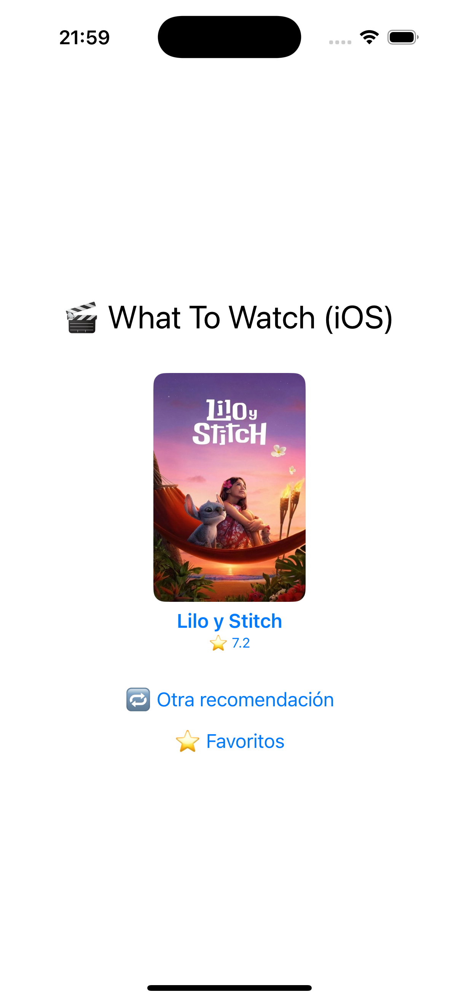
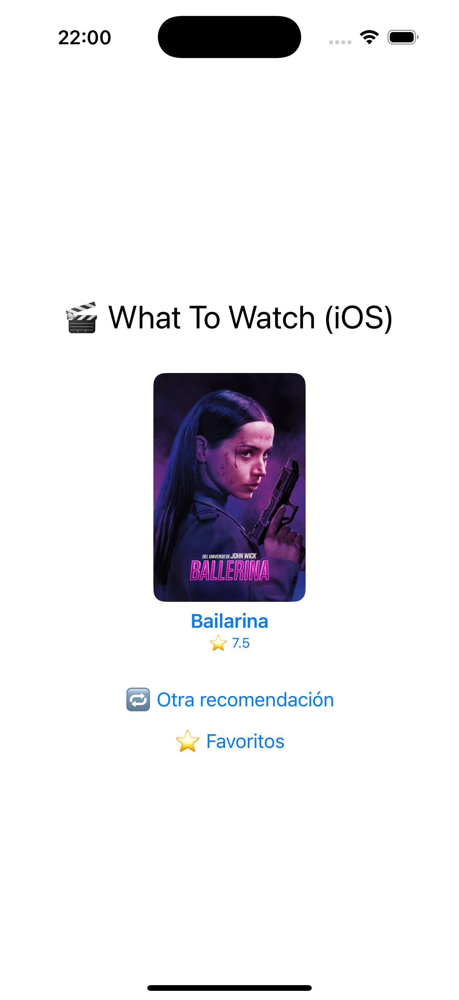
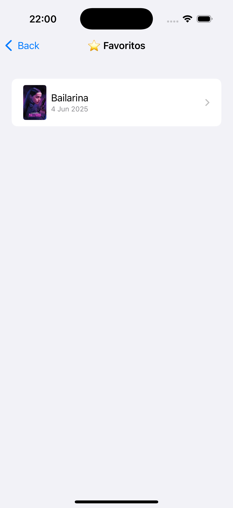
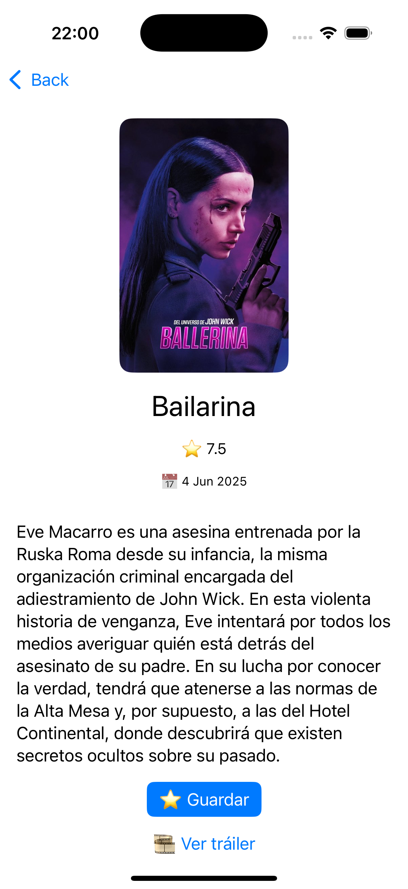
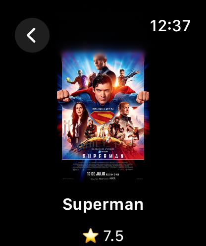
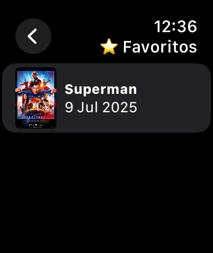
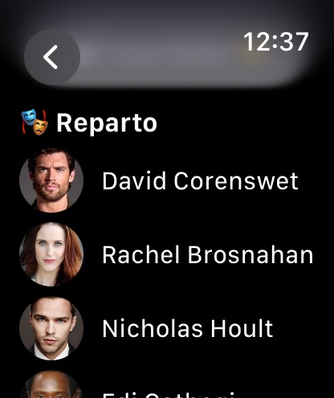

# 🎬 WhatToWatch

WhatToWatch is a daily movie and TV show recommender designed for iOS and watchOS. With a minimalist UI and a smart suggestion system, you get a new surprise every day — just tap and go!

---

## 📱 iOS App

### 🇬🇧 Description

The iOS version of WhatToWatch allows you to:

* 🎲 Get a new daily recommendation of a movie or TV show
* ⭐ Save your favorites
* 🕰️ Browse your full recommendation history (unlimited)
* 📽️ View trailers directly from the detail view
* 💫 Smooth animations and simple design for clarity
* 🔁 Request a new random recommendation

Everything is stored using `UserDefaults` for simplicity and local persistence.

### 🇪🇸 Descripción

La versión para iOS de WhatToWatch te permite:

* 🎲 Obtener una recomendación diaria de una película o serie
* ⭐ Guardar tus favoritas
* 🕰️ Consultar tu historial completo de recomendaciones (sin límite)
* 📽️ Ver tráilers directamente desde la vista de detalle
* 💫 Animaciones suaves y un diseño minimalista
* 🔁 Pedir otra recomendación aleatoria

Todos los datos se almacenan localmente usando `UserDefaults`.

---

### 📸 Capturas (iOS) / Screenshots (iOS)

| Inicio / Home     | Nueva Recomendación / New Recommendation |
| ----------------- | ---------------------------------------- |
|  |                         |

| Favoritos / Favorites | Detalle con tráiler / Detail with Trailer |
| --------------------- | ----------------------------------------- |
|      |                          |

---

## ⌚ watchOS App

### 🇬🇧 Description

The watchOS version provides a lightweight experience:

* ⌚ See today’s recommendation instantly on your wrist
* ⭐ Favorite or unfavorite directly from your Apple Watch with animation
* 💬 Read the synopsis and cast
* 🧠 Syncs seamlessly with iOS app via `App Groups`
* 🧭 Uses `@AppStorage` to persist favorites and history
* 🧩 Includes a watchOS complication to display the title and poster on your watch face

> 🎥 Trailer feature was removed on watchOS due to limitations. All trailer functionality lives on iOS.

### 🇪🇸 Descripción

La versión para Apple Watch ofrece una experiencia ligera:

* ⌚ Consulta la recomendación del día directamente desde tu muñeca
* ⭐ Marca o desmarca favoritas con animación
* 💬 Lee la sinopsis y el reparto
* 🧠 Sincronización con la app de iOS mediante `App Groups`
* 🧭 Persistencia local usando `@AppStorage`
* 🧩 Incluye una complicación que muestra el título y la imagen en la carátula del reloj

> 🎥 La funcionalidad de tráiler fue eliminada en watchOS por limitaciones técnicas. Los tráilers están disponibles en la app de iOS.

---

### 📸 Capturas (watchOS) / Screenshots (watchOS)

| 🕰️ Complicación del reloj / Watch Face Complication | 🧾 Detalle con sinopsis / Detail View with Synopsis |
|------------------------------------------------------|----------------------------------------------------|
|                                     |                                   |

| ⭐ Favorito animado / Favorite toggle with Animation  | 🧑‍🤝‍🧑 Reparto / Cast                                 |
|                                    |                                  |

---

## 🛠️ Tecnologías utilizadas / Technologies used

* SwiftUI
* WidgetKit (for complication)
* AVKit (iOS trailers)
* WatchConnectivity (communication Watch ↔ iPhone)
* TMDb API (recommendations and metadata)
* UserDefaults & AppStorage (persistence)

---

## 🚀 Cómo usar / How to use

1. Clona el repositorio / Clone the repository
2. Abre el proyecto en Xcode / Open the project in Xcode
3. Ejecuta tanto iOS como watchOS / Run both iOS and watchOS targets
4. Configura tu clave de API / Configure your TMDb API key
5. Ejecuta en simulador o dispositivo físico / Run on simulator or physical device

---

## 👨‍💻 Autor / Author

Desarrollado **Dorjee** / Developed by **Dorjee**

---
